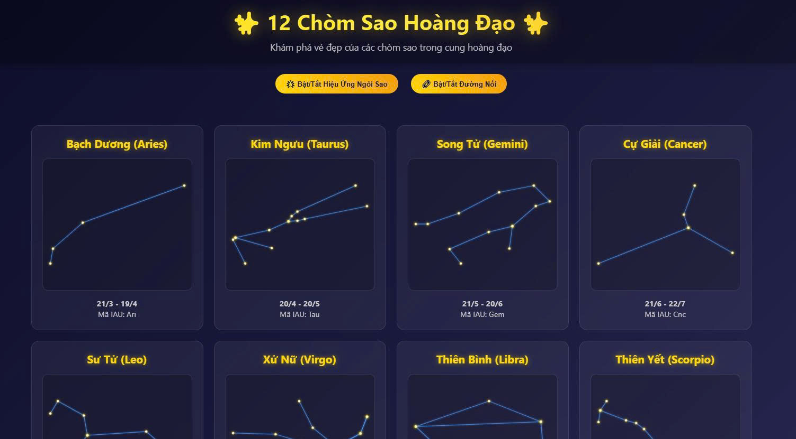

# 🌟 12 Chòm Sao Hoàng Đạo

Khám phá vẻ đẹp và ý nghĩa của 12 chòm sao trong cung hoàng đạo. Mỗi chòm sao đại diện cho một khoảng thời gian trong năm và mang những đặc điểm tính cách riêng biệt.

## 🔭 Danh sách 12 chòm sao:

1. **Bạch Dương (Aries)**: 21/3 – 19/4  
2. **Kim Ngưu (Taurus)**: 20/4 – 20/5  
3. **Song Tử (Gemini)**: 21/5 – 20/6  
4. **Cự Giải (Cancer)**: 21/6 – 22/7  
5. **Sư Tử (Leo)**: 23/7 – 22/8  
6. **Xử Nữ (Virgo)**: 23/8 – 22/9  
7. **Thiên Bình (Libra)**: 23/9 – 22/10  
8. **Thiên Yết (Scorpio)**: 23/10 – 21/11  
9. **Nhân Mã (Sagittarius)**: 22/11 – 21/12  
10. **Ma Kết (Capricorn)**: 22/12 – 19/1  
11. **Bảo Bình (Aquarius)**: 20/1 – 18/2  
12. **Song Ngư (Pisces)**: 19/2 – 20/3

## 📷 Hình ảnh minh họa các chòm sao

(./zodiac2.jpg)

---

